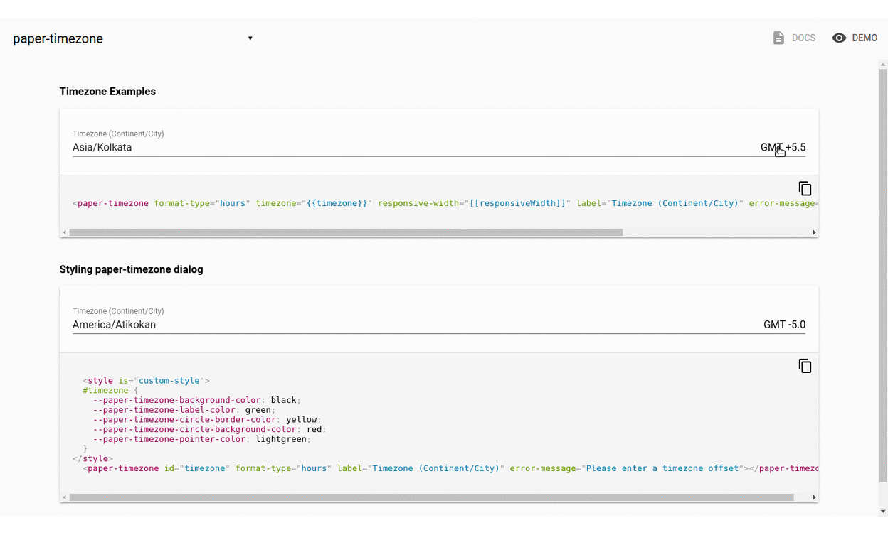
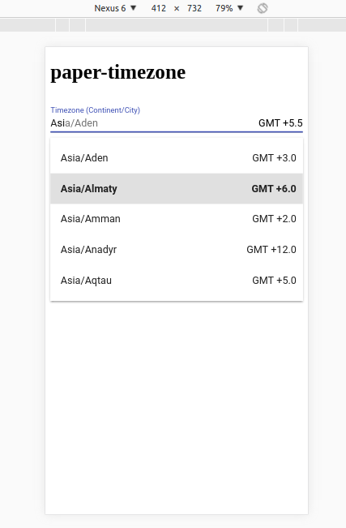

# paper-timezone

This component based on moment-timezone to select timezone based on location. Check more about moment-timezone [here](http://momentjs.com/timezone/)
The component has two features that it can be used for desktop and mobile. 
In desktop it is displayed as map dialog and in mobile view dropdown will be displayed.


 - Demos can be found [here](http://github.com/bluewatertracks/paper-timezone)
 - Below is sample screenshot in dialog view.



- Below is sample screenshot in dropdown view



## Features
 - It also supports for mobile devices so that it can be viewed as dropdown in mobile devices.
 - Extremely simple to set up ([simple demo](http://bluewatertracks.github.io/paper-timezone/))
 - Format type is property that show offset as suffix in hours or minutes. By default it will be shown in minutes. 
 - Support custom styling ([demo](http://bluewatertracks.github.io/paper-timezone/))

## Installation

The element can be installed using bower using

    bower install --save paper-timezone

## Usage

- Following code is required to place in the polymer web component.
		<paper-timezone  name="timezone" timezone="[[timezone]]" label="Timezone (Continent/City)" error-message="Please enter a timezone offset"></paper-timezone>
- It is used to select timezone offset from dialog or dropdown.
Check out the [getting started guide](http://bluewatertracks.github.io/paper-timezone/).

## Examples

Default timezone:

```html
<paper-timezone  name="timezone" timezone="[[timezone]]" label="Timezone (Continent/City)" error-message="Please enter a timezone offset"></paper-timezone>
```

You may also specify a responsive width to display this element as dropdown. 
```html
<paper-timezone timezone="[[timezone]]" responsive-width="[[responsiveWidth]]" label="Timezone (Continent/City)" error-message="Please enter a timezone offset"></paper-timezone>
```

Format type is property that show offset as suffix in hours or minutes. By default it will be shown in minutes. 

```html
<paper-timezone format-type="hours" timezone="[[timezone]]" label="Timezone (Continent/City)" error-message="Please enter a timezone offset"></paper-timezone>
```

## Reporting Bugs

When filing a bug report, please provide an example of how to repoduce using
plunker, jsbin, jsfiddle, etc.


## License

This program is free software: you can redistribute it and/or modify
it under the terms of the GNU General Public License version 3 of the License as published by
the Free Software Foundation.

This program is distributed in the hope that it will be useful,
but WITHOUT ANY WARRANTY; without even the implied warranty of
MERCHANTABILITY or FITNESS FOR A PARTICULAR PURPOSE.  See the
GNU General Public License for more details.


## Contributing

We absolutely love sending us new pull requests, so let us just outline some advice:

 1. If you are planning on doing anything except a quick fix, it's a wise idea to open an issue first with your plans. That
    way we can talk it through and check whether it might not already be easily possible and whether it fits with the
    spirit of the component (I try to keep everything pretty declarative, generic and Polymer-y).
 2. You absolutely *must* make every feature you work on at least a separate commit and ideally a separate pull request.
    This both makes it clearer to me what is what, makes it easier to pull only the relevant parts and prevents situations
    where I can't give credits to the good parts, because of the bad parts.
 3. You have to explicitly agree in your pull request to the terms described in the
    [fair share license construction](https://github.com/).

## Contributers


- [@bhargavkonkathi](/bhargavkonkathi)  [@maisnamraju](/@maisnamraju) [@dhrytsenko](/dhrytsenko)